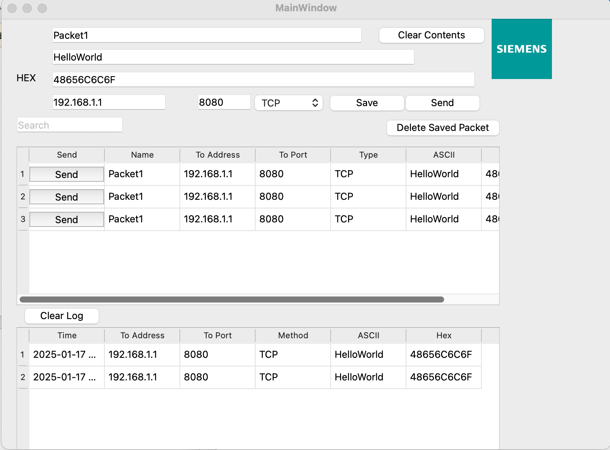

# PackGen - Packet Generator Simulation 📦


**PackGen** is a simple GUI application built using **Qt** that simulates a packet generator. It allows users to enter packet details, save them in a "Saved Packets" table, or send them to a "Sent Packets" table. This application is designed to demonstrate basic **Qt GUI development** and **packet simulation**.

---

## Table of Contents 📚
- [Features](#features)
- [Repository Structure](#repository-structure)
- [Prerequisites](#prerequisites)
- [How to Launch the App](#how-to-launch-the-app)
  - [On macOS/Linux](#on-macoslinux)
  - [On Windows](#on-windows)
- [How to Use the App](#how-to-use-the-app)

---

## Features ✨

- **Packet Details Input**: Enter packet details such as source, destination, protocol, and payload.
- **Save Packets**: Save entered packets to the "Saved Packets" table for later use.
- **Send Packets**: Send packets to the "Sent Packets" table to simulate transmission.
- **Simple and Intuitive UI**: Built using Qt's powerful GUI framework for a clean and user-friendly experience.

---
## How to Use the App 🖥️

-**Enter Packet Details**:
  Fill in the packet details (e.g., source, destination, protocol, payload) in the input fields.
-**Save Packet**:
  Click the "Save" button to save the packet to the "Saved Packets" table.
-**Send Packet**:
  Click the "Send" button to send the packet to the "Sent Packets" table.
-**View Packets**:
The "Saved Packets" table displays all saved packets.
The "Sent Packets" table displays all sent packets.

## building the exec on Macos  ✨

- **Configure the Project for Release**
- **Clean the Project**: Clean All
- **Build the Project**: Select the Release build configuration from the dropdown menu.
- **Deploy the Application**: macdeployqt path/to/YourApp.app

## Running tests  ✨

- **Go to SquishDir/bin**: open 2 terminals.
- **Start Server**:seifallahmohamedkishtah@SeifAllahs-MacBook-Air bin % squishserver --verbose --logfile /Users/seifallahmohamedkishtah/Desktop/TestSuites/logfile.txt
- **Start Runner on Another Terminal**: seifallahmohamedkishtah@SeifAllahs-MacBook-Air bin % squishrunner --testsuite /Users/seifallahmohamedkishtah/Desktop/TestSuites/suite_PackgenSuite --resultdir /Users/seifallahmohamedkishtah/Desktop/TestSuites/suite_PackgenSuite/results --reportgen xls
- **if you want to change the result file**: seifallahmohamedkishtah@SeifAllahs-MacBook-Air bin % squishrunner --testsuite /Users/seifallahmohamedkishtah/Desktop/TestSuites/suite_PackgenSuite --reportgen html,/Users/seifallahmohamedkishtah/Desktop/TestSuites/suite_PackgenSuite/results
## App Screenshot



## Repository Structure 🗂️

```plaintext
PackGen/
├── CMakeLists.txt              # Root CMake configuration file
├── README.md                   # Project documentation (this file)
├── src/                        # Source code directory
│   ├── main.cpp                # Main application file
│   ├── mainwindow.cpp          # Implementation of the main window
│   ├── mainwindow.h            # Header file for the main window
│   └── mainwindow.ui           # UI file for the main window (created using Qt Designer)
├── resources/                  # Resource files (e.g., icons, images)
│   ├── siemens.qrc             # Resource file for the app
│   └── images/                 # Optional: Folder for images
│       └── icon.png            # Example icon file
└── .gitignore                  # Specifies files to ignore in Git


